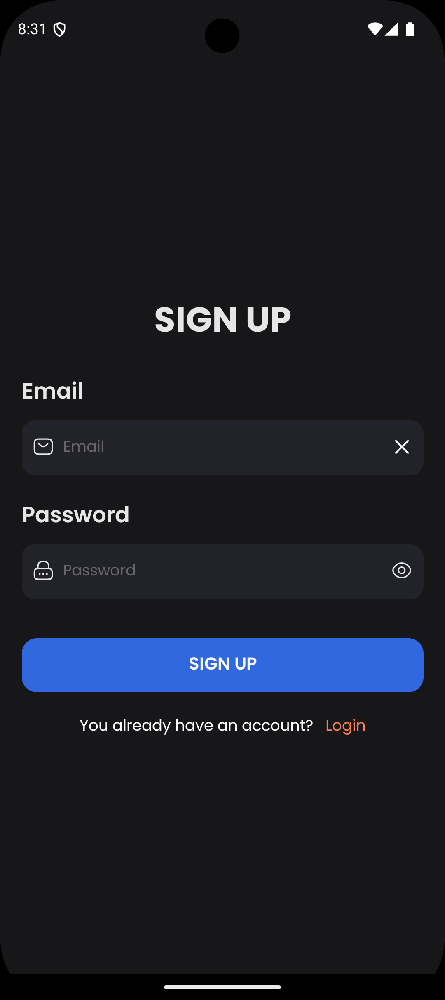

# **CollaboList**
*Mobile Collaborative Task Management App*
*React Native | TypeScript | Firebase | HTML | CSS | Figma*

## **Overview**
**CollaboList** is an enhanced to-do list app designed to help teams collaborate on tasks, set deadlines, track progress, and share files in real time. Built with React Native for cross-platform development and leveraging modern web technologies like TypeScript, Firebase, and Figma, this app provides a seamless and intuitive task management experience.

## **Key Features**
- **Collaborative Task Management**: Create tasks, add collaborators, set deadlines, and track progress.
- **Real-Time Sync**: Data is synchronized across devices in real time using **Firebase Firestore**.
- **Secure User Authentication**: Users can securely sign in and out via **Firebase Authentication**.
- **File Sharing**: Upload and share files within tasks using **Firebase Storage**.
- **Cross-Platform Compatibility**: Built using **React Native** to support both iOS and Android.
- **Responsive UI**: Designed a smooth, user-friendly interface using **HTML**, **CSS**, and **TypeScript**.
- **UI/UX Design**: Crafted prototypes and UI designs with **Figma** for an intuitive user experience.

### Login Screen

### Signup Screen

### Home Screen

### Add Task Screen

## **Technologies Used**
- **Frontend**: React Native, TypeScript, HTML, CSS
- **Backend**: Firebase (Authentication, Firestore, Storage)
- **UI/UX Design**: Figma
- **Other**: API interactions for data management